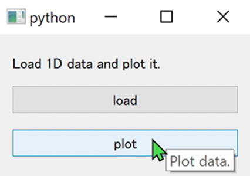

# magic-class

In [magicgui](https://github.com/napari/magicgui) you can make simple GUIs from functions. However, we usually have to create GUIs that are composed of several buttons, and each button is connected with a class method.

Decorate your class with `@magicclass` and your can use the class both in GUI and from console!

`magic-class` is work in progress. Feel free to report issues and make suggestions :smile:.

## Installation

- use pip

```
pip install git+https://github.com/hanjinliu/magic-class
```

- from source
```
git clone https://github.com/hanjinliu/magic-class
```

### Example

Let's make a simple GUI that can load 1-D data and plot it.

```python
from magicclass import magicclass
from pathlib import Path

@magicclass
class PlotData:
    """
    Load 1D data and plot it.
    """
    def __init__(self, title=None):
        self.title = title
        self.data = None
        self.path = None
        
    def load(self, path:Path):
        """
        Load file.
        """
        self.path = str(path)
        self.data = np.loadtxt(path)
        
    def plot(self):
        """
        Plot data.
        """
        if self.title:
            plt.title(self.title)
        plt.plot(self.data)
        plt.show()
```

Classes decorated with `@magicclass` are converted to `magicgui`'s `Container` widgets. GUI starts with `show` method.

```python
widget = PlotData(title="Title")
widget.show()
```



You can continue analysis in console.

```python
widget.plot()
```

`magic-class` is also compatible with [napari](https://github.com/napari/napari). You can add them to viewers as dock widgets.

```python
import napari
viewer = napari.Viewer()
viewer.window.add_dock_widget(widget)
```

Other examples are in the "examples" folder.