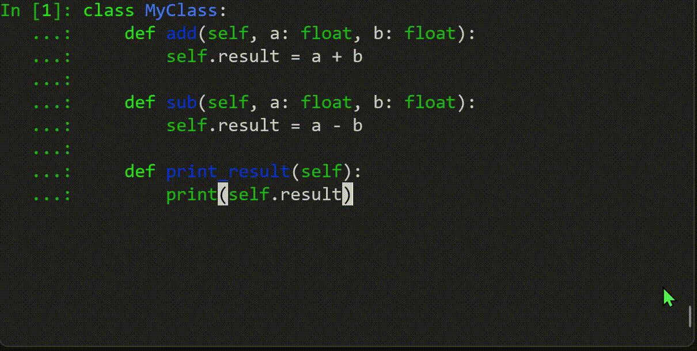

[](https://pepy.tech/project/magic-class)
[](https://badge.fury.io/py/magic-class)

# magic-class



`magic-class` makes GUI development as easy as daily coding by converting well-typed Python class directly into GUI. It is powered by [magicgui](https://github.com/napari/magicgui) and has smooth interface with [napari](https://github.com/napari/napari). `magic-class` is also implemented with useful widgets such as `matplotlib` figure canvas, logger widget and color edit.

#### Target users

- Researchers who already have their Python functions and classes and are planing to take a step forward to improve the interface using GUI, with minimum effort.
- Non-professional programmers who don't want to spend time on debugging and maintaining GUI.
- Users who are not satisfied with the low reproducibility of the most of the GUI.
- People who are familiar with `magicgui` and interested in more sophisticated GUI using typing.

#### How magic-class solves your problems

- Decorate your class with `@magicclass` and you are ready to use the class both in GUI and from console.
- `@magicclass` implements macro-recorder in the class. You can easily create executable Python codes from the history of manual operations.
- Your code looks almost "Pythonic". No need to be confused by messy class structure pecuilar to GUI development anymore.

`magic-class` is work in progress. Feel free to report issues, make suggestions and contribute!

## Documentation

Documentation is available [here](https://hanjinliu.github.io/magic-class/).

## Installation

- use pip

```
pip install magic-class
```

- from source

```
git clone https://github.com/hanjinliu/magic-class
```

## Example

Let's make a simple GUI that can load 1-D data and plot it.

```python
from magicclass import magicclass
from pathlib import Path

@magicclass
class PlotData:
    """Load 1D data and plot it."""

    def load(self, path: Path):
        """
        Load file.

        Parameters
        ----------
        path : Path
            File path
        """
        self.data = np.loadtxt(str(path))

    def plot(self):
        """
        Plot data.
        """
        plt.plot(self.data)
        plt.show()
```

Classes decorated with `@magicclass` are converted to `magicgui`'s `Container` widgets. GUI starts with `show` method.

```python
ui = PlotData(title="Title")
ui.show()
```

You can continue analysis in console.

```python
ui.plot()
```

For people doing image analysis, it can added to a `napari` viewer as a dock widget.

```python
import napari
viewer = napari.Viewer()
viewer.window.add_dock_widget(ui)
```

Executable Python code (so called "macro" in many GUI tools) is available in `macro` attribute.

```python
print(ui.macro)  # print macro
ui.macro.widget.show()  # open a text editor widget with macro written in
```

To make nicer GUI, you can also nest `magic-class`:

```python
@magicclass
class PlotData:
    @magicclass
    class Menu: ...
```

add a menubar with `@magicmenu` decorator:

```python
@magicclass
class PlotData:
    @magicmenu
    class File: ...
    @magicmenu
    class Edit: ...
```

add context menu with `@magiccontext` decorator:

```python
@magicclass
class PlotData:
    @magiccontext
    class contextmenu: ...
        def Copy(self): ...
        def Paste(self): ...

```

directly integrate `magicgui` and its widgets:

```python
@magicclass
class PlotData:
    line = LineEdit()
    @magicgui
    def load(self, path: Path): ...
```

... and so on.

Other examples are in the "examples" folder.
