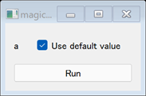
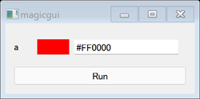

# Additional types

To make implementation simpler, `magic-class` has some additional types
that were not available in `magicgui`.

## `Optional` type

`Optional` type is almost identical to `typing.Optional`. Using this
type annotation `@magicgui` can create an `OptionalWidget`, which has a
checkbox and an widget of any type. It represents `None` if the checkbox
is checked.

``` python
from magicgui import magicgui
from magicclass.types import Optional

@magicgui
def func(a: Optional[int]):
    print(a)
func
```



The "Use default value" text can be changed by "text" option.
Options of the inner widget (`SpinBox` in this example) can be set by
"options" option.

``` python
from magicgui import magicgui
from magicclass.types import Optional

@magicgui(a={"text": "Don't need a value", "options": {"min": 1, "max": 10}})
def func(a: Optional[int]):
    print(a)
func
```

## `Color` type

There is no straightforward way to use a color as an input. In
`magic-class` you can use `Color` type as a type annotation. This type
is an alias of `Union[Iterable[float], str]` and is converted into
`ColorEdit` widget. `ColorEdit` behaves very similar to the color editor
in `napari`'s layer control.

``` python
from magicgui import magicgui
from magicclass.types import Color

@magicgui
def func(col: Color = "red"):
    print(col)
func
```



## `Path` type

`pathlib.Path` is a type supported by `magicgui` by default. However, you usually have
to specify the `mode` and `filter` parameters.

``` python
from magicgui import magicgui
from pathlib import Path

@magicgui(path={"mode": "w", "filter": "Image files (*.png)"})
def func(path: Path):
    print(path)
```

In `magicclass` you can use `magicclass.types.Path` type instead. It is identical to
`pathlib.Path` when used as a constructor, but supports many other advanced annotations.

``` python
from magicclass.types import Path

# mode="r" and filter="Image files (*.png)
@magicgui
def func1(path: Path.Read["Image files (*.png)"]):
    print("reading:", path)

# mode="w" and filter="Image files (*.png)
@magicgui
def func2(path: Path.Save["Image files (*.png)"]):
    print("saving at:", path)

# mode="rm" and filter="Image files (*.png)
@magicgui
def func3(path: Path.Multiple["Image files (*.png)"]):
    print("selected files:", path)

# mode="d"
@magicgui
def func4(path: Path.Dir):
    print("selected directory =", path)
```

## `ExprStr` type

`ExprStr` is a subtype of `str` that allows you to use a string as an expression. This
type will be mapped to `EvalLineEdit`, which supports evaluation in any namespace.

To activate auto-completion, you can use `ExprStr.In` for the type annotation. `ExprStr`
instance has `eval` method to evaluate the expression.

``` python
import numpy as np
from magicgui import magicgui
from magicclass.types import ExprStr

namespace = {"np": np}

@magicgui
def func(arr: ExprStr.In[namespace]):
    print(ExprStr(arr, namespace).eval())
func
```
