# Container Variations

## Use Other Qt Widgets as Container

In `magic-class`, many Qt widget variations are available in a same API
as `magicgui`'s `Container`. You can use them by importing from
`magicclass.widgets`:

``` python
from magicgui.widgets import LineEdit
from magicclass.widgets import ScrollableContainer

# A container with scroll area
c = ScrollableContainer()

for i in range(10):
    c.append(LineEdit())
c.show()
```

## Available Containers

Container variations are available in magic classes using `widget_type=...` keyword
argument. For instance, you can create `ButtonContainer` by
`@magicclass(widget_type="button")`. Menu bar and tool bar will be added to appropriate
spaces according to the container type.

### Default Container

This is the most basic one. Same as `magicgui`'s `Container`.

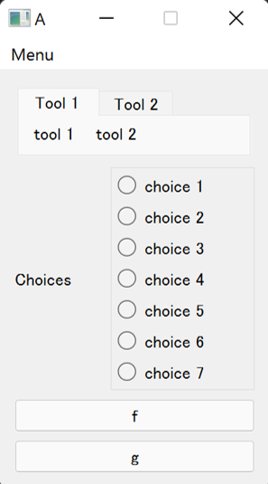

- *option*: `widget_type="none"` (not needed)

### MainWindow

Main window is used. Same as `magicgui`'s `MainWindow`. Toolbar is floatable in main
window.

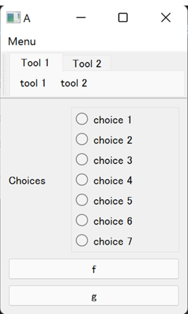

- *option*: `widget_type="mainwindow"`

### ButtonContainer

A push button widget is created. Contents of the container show up when
the button is clicked.

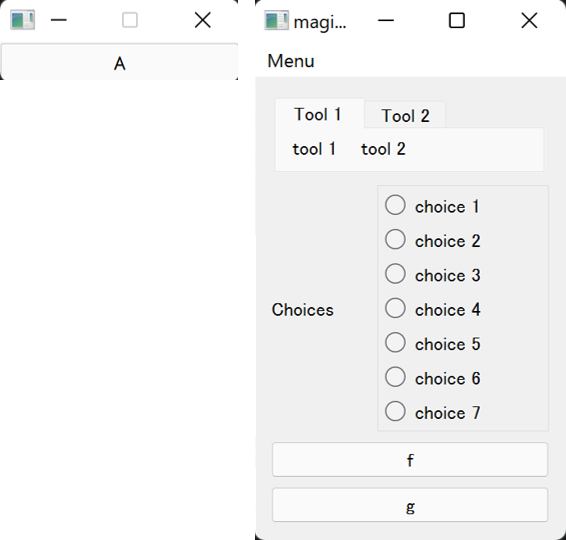

- *option*: `widget_type="button"`
- *base Qt class*: QPushButton
- *additional properties*
  - `text` ... Text of button.

### CollapsibleContainer

Collapsible/expandable widget is created.

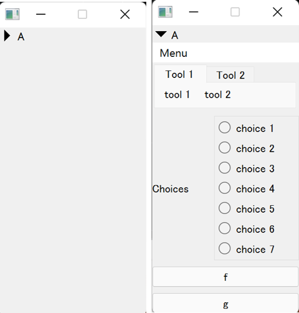

- *option*: `widget_type="collapsible"`
- *base Qt class*: QToolButton
- *additional properties*
  - `text` ... Text of button.
  - `collapsed` ... Toggle visibility of the contents.

### DraggableContainer

Container is packed in a scroll area. It can be scrolled by mouse drag.

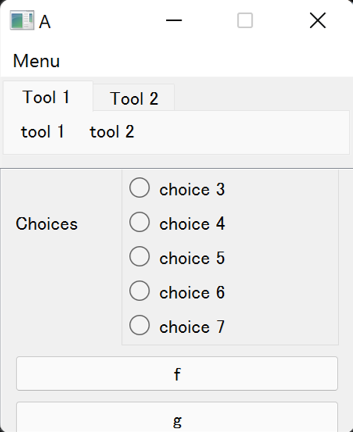

- *option*: `widget_type="draggable"`
- *base Qt class*: QScrollArea
- *additional properties* : None

### FrameContainer

Container is enclosed by a line. It does not have its title unlike
`GroupBoxContainer`

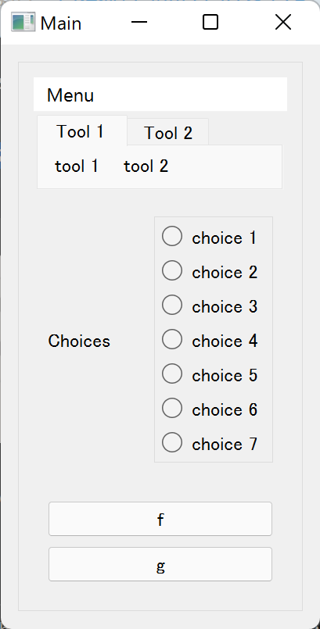

- *option*: `widget_type="frame"`
- *base Qt class*: QGroupBox
- *additional properties*: None

### GroupBoxContainer

Container is enclosed by a line. Widget name will be the title of the
group box.

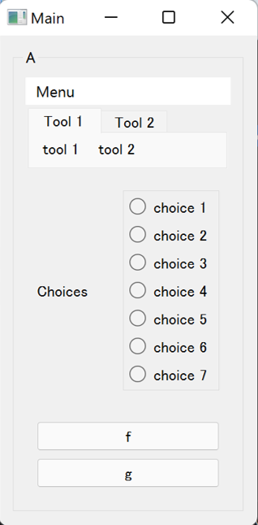

- *option*: `widget_type="groupbox"`
- *base Qt class*: QGroupBox
- *additional properties*: None

### HCollapsibleContainer

An horizontal collapsible/expandable widget is created.

- *option*: `widget_type="hcollapsible"`
- *base Qt class*: QToolButton
- *additional properties*
  - `collapsed` ... Toggle visibility of the contents.

### ListContainer

Drag-and-drop is enabled for each contents of the container.

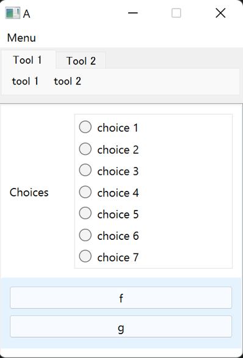

- *option*: `widget_type="list"`
- *base Qt class*: QListWidget
- *additional properties*
  - `current_index` ... Index of currently selected widget.

### SubWindowsContainer

All the child widgets are displayed as subwindows in this container.

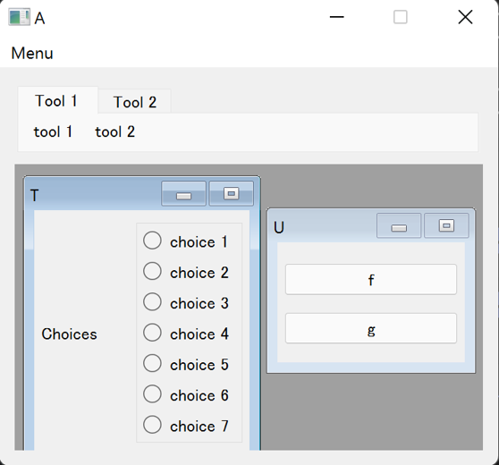

- *option*: `widget_type="subwindows"`
- *base Qt class*: QMdiArea
- *additional properties*: None

### ScrollableContainer

Container is packed in a scroll area. It can be scrolled by scroll bars.

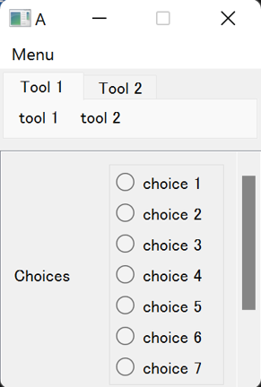

- *option*: `widget_type="scrollable"`
- *base Qt class*: QScrollArea
- *additional properties*: None

### SplitterContainer

The borders between adjacent widgets are adjustable (every child widget
is resizable). In the following image, splitter exists between the radio
buttons and two push buttons.

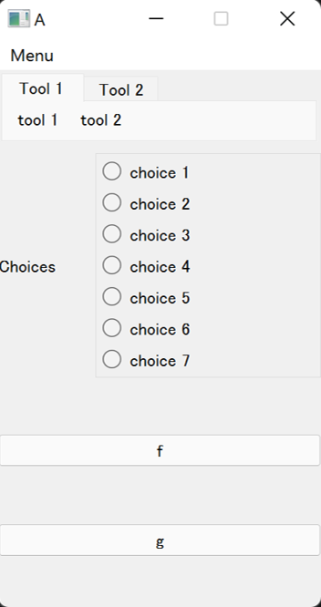

- *option*: `widget_type="split"`
- *base Qt class*: QSplitter
- *additional properties*: None.

### StackedContainer

One child widget is visible at a time. Current index must be set
programmatically or using other widgets.

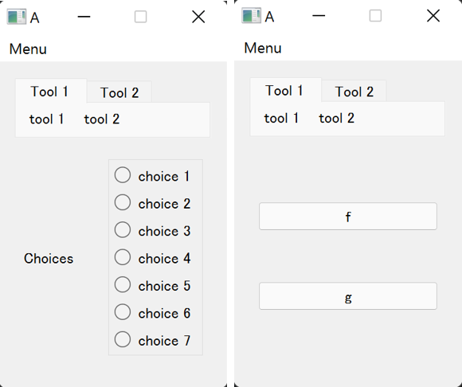

- *option*: `widget_type="stacked"`
- *base Qt class*: QStackedWidget
- *additional properties*
  - `current_index` ... Index of currently visible widget.

### TabbedContainer

Container widget composed of tabs and each widget is assigned to a tab.
The name of each tab is determined according to the widget name of each
child widget.

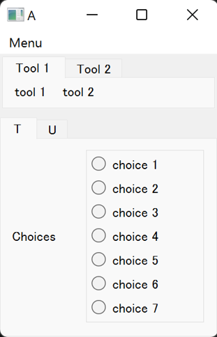

- *option*: `widget_type="tabbed"`
- *base Qt class*: QTabWidget
- *additional properties*
  - `current_index` ... Index of currently active tab.

### ToolBoxContainer

Container widget composed of collapsible tool boxes and one box is
expanded at a time. Each box has its own scroll area.

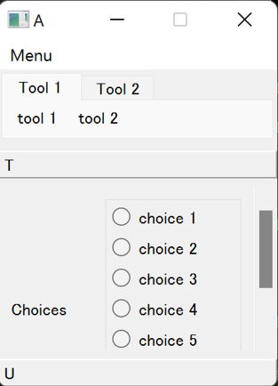

- *option*: `widget_type="toolbox"`
- *base Qt class*: QToolBox
- *additional properties*
  - `current_index` ... Index of expanded child widget.

## Type Map of Containers

| WidgetType     | Container type         |
|:--------------:|:----------------------:|
|`"none"`        | `Container`            |
|`"button"`      | `ButtonContainer`      |
|`"collapsible"` | `CollapsibleContainer` |
|`"draggable"`   | `DraggableContainer`   |
|`"frame"`       | `FrameContainer`       |
|`"groupbox"`    | `GroupBoxContainer`    |
|`"list"`        | `ListContainer`        |
|`"mainwindow"`  | `MainWindow`           |
|`"scrollable"`  | `ScrollableContainer`  |
|`"split"`       | `SplitterContainer`    |
|`"stacked"`     | `StackedContainer`     |
|`"subwindows"`  | `SubWindowsContainer`  |
|`"tabbed"`      | `TabbedContainer`      |
|`"toolbox"`     | `ToolBoxContainer`     |
