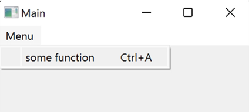

# Custom Keybindings

Keybindings are very useful in many situations, especially when some functions will be
called many times. In most cases, you will have to set shortcuts to a push button or an
action in the menu so that bound function will be accessible via GUI.

Magic class provides a wrapper function which makes it easy to implement custom
keybindings, and like other wrappers, you don\'t have to worry about reducing code readability.

## How to Define Keybindings

All you have to do is to wrap methods with `bind_key` function.

``` python
from magicclass import magicclass, bind_key

@magicclass
class Main:
    @bind_key("Ctrl+A") # Qt-style
    def function_1(self):
        print(1)

    @bind_key("Ctrl-B") # napari-style
    def function_2(self):
        print(2)
```

!!! note

    If you are going to use magic class as a dock widget in `napari`, make
    sure there is no collision between your keybindings and those in
    `napari`.

## Decorate Private Functions

Although private functions (functions whose names start with "_") will not be converted
into widgets, it is very useful to define "invisible" shortcuts. A typical case is when
you want to change widget values with shortcut.

``` python
from magicclass import magicclass, field, bind_key, do_not_record

@magicclass
class Main:
    a = field(int)
    def button(self):
        """Click this button to remove focus from the spin box."""

    @bind_key("Up")
    def _increment(self):
        self.a.value = min(self.a.value + 1, self.a.max)

    @bind_key("Down")
    def _decrement(self):
        self.a.value = max(self.a.value - 1, self.a.min)
```

Widget defined by this class is equipped with shortcuts that can change
the value of `a` without clicking the spin box.

## Key combos

As Qt supports it, you can also define key combos.

``` python
from magicclass import magicclass, bind_key

@magicclass
class Main:
    @bind_key("Ctrl+K, Ctrl+L")
    def function_1(self):
        print(1)
```

## Compatibility with Other Features

Keybindings are compatible with other functions in magic class.

You can call parent methods by combining with `wraps` method (see
`/main/make_better/use_wraps`{.interpreted-text role="doc"}).

``` python
from magicclass import magicclass, magicmenu, bind_key

@magicclass
class Main:
    @magicmenu
    class Menu:
        def some_function(self): ...

    @Menu.wraps
    @bind_key("Ctrl+A")
    def some_function(self):
        print(self.__class__.__name__) # should be "Main"
```

In this example, shortcut description appears in the menu.



You can also bind values of fields or other methods (see [how to bind values](../make_better/bind.md)).

``` python
from magicclass import magicclass, bind_key, field
from typing import Annotated

@magicclass
class Main:
    a = field(int)
    @bind_key("Ctrl-A")
    def print_value(self, a: Annotated[int {"bind": a}]):
        print(a)
```

Function calls triggered by shortcut are also recorded in macro.
