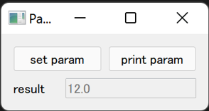

==================================
Call Parent Methods from its Child
==================================

When you want to define a function under the parent class while put its push button or action in the child
widget for widget design, code will look very complicated and will be hard to maintain. This problem 
usually happens when you want a menu bar, since menu actions always execute something using the parameters
of its parent and often update its parent.

With class method ``warps`` of ``magicclass``, you can easily connect parent methods to its child while
keeping code clean.

Basic Syntax
------------

You have to do is:

1. Define child class
2. Define parent method
3. Define a child method with the same name as that of parent's (not necessary but recommended)
4. Wrap the parent method with ``wraps`` function of the child class.

Following example shows how to call ``set_param`` and ``print_param`` functions from its child class
``Child``.

.. code-block:: python

    from magicclass import magicclass, field

    @magicclass
    class Parent:
        param = 0.1

        @magicclass(layout="horizontal")
        class Child:
            # A frame of buttons
            def set_param(self): ...
            def print_param(self): ...
        
        # a result widget
        result = field(widget_type="LineEdit", options={"enabled": False})
        
        @Child.wraps
        def set_param(self, value: float):
            self.param = value

        @Child.wraps
        def print_param(self):
            self.result.value = self.param
    
    ui = Parent()
    ui.show()

The wrapped parent method will not appear in the parent widget because they already exist in the child widget.

.. note::
    Method predefinition in Step 3. is not a must. It is recommended, however, in several reasons:

    1. It plays as an "index" of functions. One can know what functions are implemented in the GUI, and in what
       order they will appear in widgets.

    2. If the widget is composed of nested magic classes and other widgets or fields, the order of
       widgets will not be sorted due to different timing of widget creation.

Use Template Function
---------------------

