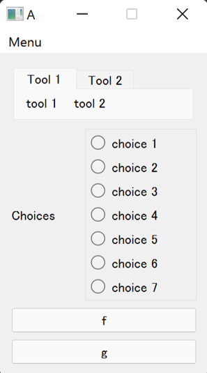
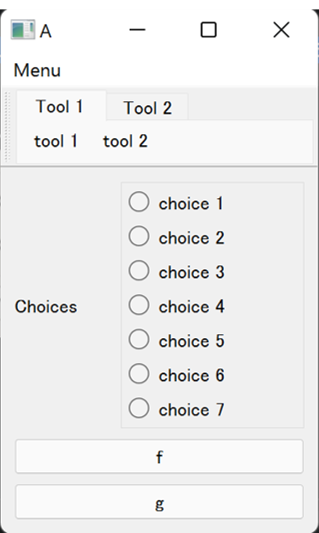
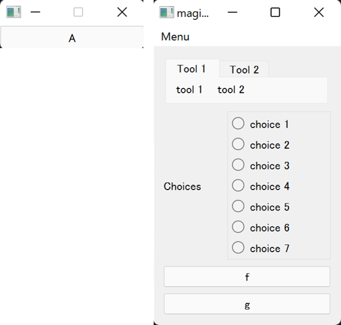
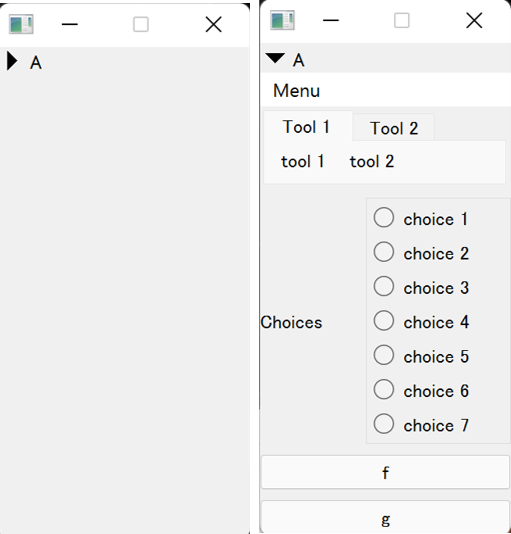
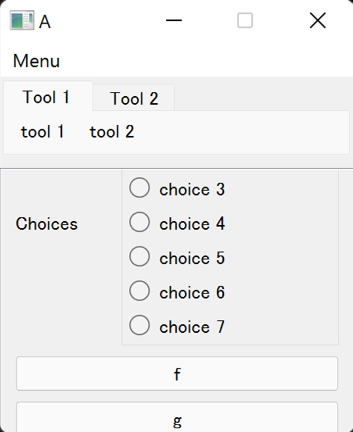
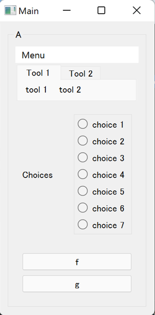
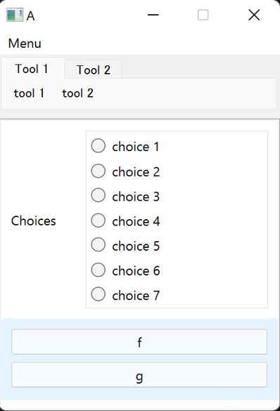
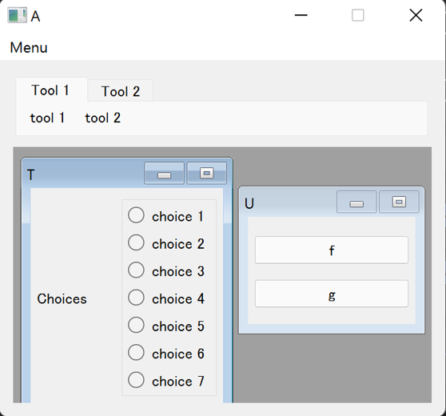
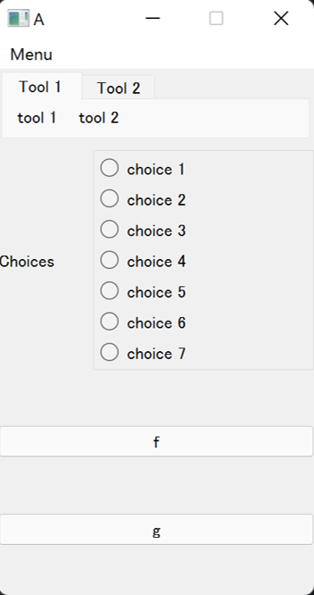
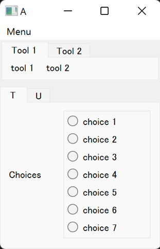

====================
Container Variations
====================

Use Other Qt Widgets as Container
---------------------------------

In ``magic-class``, many Qt widget variations are available in a same API as ``magicgui``'s ``Container``.
You can use them by importing from ``magicclass.widgets``:

.. code-block:: python

    from magicgui.widgets import LineEdit, ScrollableContainer

    # A container with scroll area
    c = ScrollableContainer()

    for i in range(10):
        c.append(LineEdit())
    c.show()

.. image:: images/fig_5-1.png

Available Containers
--------------------

Container variations are available in magic classes using `widget_type=...` keyword argument.
For instance, you can create ``ButtonContainer`` by ``@magicclass(widget_type="button")``. Menu bar and
tool bar will be added to appropriate spaces according to the container type.

Default Container
^^^^^^^^^^^^^^^^^

This is the most basic one. Same as ``magicgui``'s ``Container``.

+ *option*: ``widget_type="none"`` (not needed)

MainWindow
^^^^^^^^^^

Main window is used. Same as ``magicgui``'s ``MainWindow``. Toolbar is floatable in main window.

+ *option*: ``widget_type="mainwindow"``

ButtonContainer
^^^^^^^^^^^^^^^

A push button widget is created. Contents of the container show up when the button is clicked.

+ *option*: ``widget_type="button"``
+ *base Qt class*: QPushButton
+ *additional properties*
    ``text`` ... Text of button.

CollapsibleContainer
^^^^^^^^^^^^^^^^^^^^

Collapsible/expandable widget is created.

+ *option*: ``widget_type="collapsible"``
+ *base Qt class*: QToolButton
+ *additional properties*
    ``text`` ... Text of button.
    ``collapsed`` ... Toggle visibility of the contents.

DraggableContainer
^^^^^^^^^^^^^^^^^^

Container is packed in a scroll area. It can be scrolled by mouse drag.

+ *option*: ``widget_type="draggable"``
+ *base Qt class*: QScrollArea
+ *additional properties*
    None

FrameContainer
^^^^^^^^^^^^^^

Container is enclosed by a line. It does not have its title unlike ``GroupBoxContainer``

.. image:: images/fig_5-frame.png

+ *option*: ``widget_type="frame"``
+ *base Qt class*: QGroupBox
+ *additional properties*
    None

GroupBoxContainer
^^^^^^^^^^^^^^^^^

Container is enclosed by a line. Widget name will be the title of the group box.

+ *option*: ``widget_type="groupbox"``
+ *base Qt class*: QGroupBox
+ *additional properties*
    None

HCollapsibleContainer
^^^^^^^^^^^^^^^^^^^^^

An horizontal collapsible/expandable widget is created.

+ *option*: ``widget_type="hcollapsible"``
+ *base Qt class*: QToolButton
+ *additional properties*
    ``collapsed`` ... Toggle visibility of the contents.

ListContainer
^^^^^^^^^^^^^

Drag-and-drop is enabled for each contents of the container.

+ *option*: ``widget_type="list"``
+ *base Qt class*: QListWidget
+ *additional properties*
    ``current_index`` ... Index of currently selected widget.

SubWindowsContainer
^^^^^^^^^^^^^^^^^^^

All the child widgets are displayed as subwindows in this container.

+ *option*: ``widget_type="subwindows"``
+ *base Qt class*: QMdiArea
+ *additional properties*
    None

ScrollableContainer
^^^^^^^^^^^^^^^^^^^

Container is packed in a scroll area. It can be scrolled by scroll bars.

.. image:: images/fig_5-scrollable.png

+ *option*: ``widget_type="scrollable"``
+ *base Qt class*: QScrollArea
+ *additional properties*
    None

SplitterContainer
^^^^^^^^^^^^^^^^^

The borders between adjacent widgets are adjustable (every child widget is resizable).
In the following image, splitter exists between the radio buttons and two push buttons.

+ *option*: ``widget_type="split"``
+ *base Qt class*: QSplitter
+ *additional properties*
    None.

StackedContainer
^^^^^^^^^^^^^^^^

One child widget is visible at a time. Current index must be set programmatically or using other widgets.

.. image:: images/fig_5-stacked.png

+ *option*: ``widget_type="stacked"``
+ *base Qt class*: QStackedWidget
+ *additional properties*
    ``current_index`` ... Index of currently visible widget.

TabbedContainer
^^^^^^^^^^^^^^^

Container widget composed of tabs and each widget is assigned to a tab. The name of each tab is
determined according to the widget name of each child widget.

+ *option*: ``widget_type="tabbed"``
+ *base Qt class*: QTabWidget
+ *additional properties*
    ``current_index`` ... Index of currently active tab.

ToolBoxContainer
^^^^^^^^^^^^^^^^

Container widget composed of collapsible tool boxes and one box is expanded at a time. Each box has
its own scroll area.

.. image:: images/fig_5-toolbox.png

+ *option*: ``widget_type="toolbox"``
+ *base Qt class*: QToolBox
+ *additional properties*
    ``current_index`` ... Index of expanded child widget.

Type Map of Containers
----------------------

=========== ====================
WidgetType  Container
=========== ====================
none        Container
button      ButtonContainer
collapsible CollapsibleContainer
draggable   DraggableContainer
frame       FrameContainer
groupbox    GroupBoxContainer
list        ListContainer
mainwindow  MainWindow
scrollable  ScrollableContainer
split       SplitterContainer
stacked     StackedContainer
subwindows  SubWindowsContainer
tabbed      TabbedContainer
toolbox     ToolBoxContainer
=========== ====================
