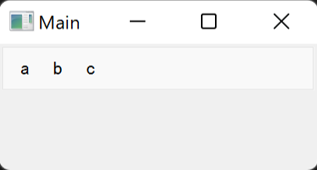

==================
Nest magic-classes
==================

Basics
------

Magic classes can be nested. During magic class construction, when a magic class encountered another
magic class object, the child object is appended to the parent.

.. code-block:: python

    from magicclass import magicclass

    @magicclass(layout="horizontal")
    class Frame1:
        def first_a(self): ...
        def first_b(self): ...

    @magicclass(layout="horizontal")
    class Frame2:
        def second_a(self): ...
        def second_b(self): ...
        def second_c(self): ...

    @magicclass
    class Main:
        frame1 = Frame1()
        frame2 = Frame2()

    ui = Main()
    ui.show()

You can also directly define the child classes inside the parent.

.. code-block:: python

    from magicclass import magicclass

    @magicclass
    class Main:
        @magicclass(layout="horizontal")
        class Frame1:
            def first_a(self): ...
            def first_b(self): ...

        @magicclass(layout="horizontal")
        class Frame2:
            def second_a(self): ...
            def second_b(self): ...
            def second_c(self): ...

    ui = Main()
    ui.show()

.. image:: images/fig_2-1.png

Make Menus Using Nesting Strategy
---------------------------------

To make multi-functional widgets, we usually want to use a menu bar to categorize functions.
The ``@magicmenu`` decorator provides a consistent API to implement a menu bar as a standard magic class.

.. code-block:: python

    from magicclass import magicclass, magicmenu

    @magicclass
    class Main:
        @magicmenu
        class File:
            @magicmenu
            class New:
                def first_a(self): ...
                def first_b(self): ...
            def Open(self): ...
            def Close(self): ...

        @magicmenu
        class Edit:
            ...

    ui = Main()
    ui.show()

.. image:: images/fig_2-2.png

If multiple menus are defined in tandem, they will all added to the menu bar.

Same strategy also works for right-click context menu.

.. code-block:: python

    from magicclass import magicclass, magiccontext

    @magicclass
    class Main:
        @magiccontext
        class ContextMenu:
            def Copy(self): ...
            def Paste(self): ...
            @magiccontext
            class Others:
                def function_a(self): ...
                def function_b(self): ...
                def function_c(self): ...

    ui = Main()
    ui.show()

.. image:: images/fig_2-3.png

Make Toolbar
------------

Similar to menus, magic class also provide a toolbar widget with same API. ``@magictoolbar`` is the
decorator for toolbar.

.. code-block:: python

    from magicclass import magicclass, magictoolbar

    @magicclass
    class Main:
        @magictoolbar
        class ToolBar:
            def a(self): ...
            def b(self): ...
            def c(self): ...

If multiple toolbars are defined in tandem, they will split by tabs.
