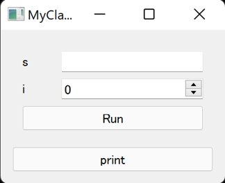
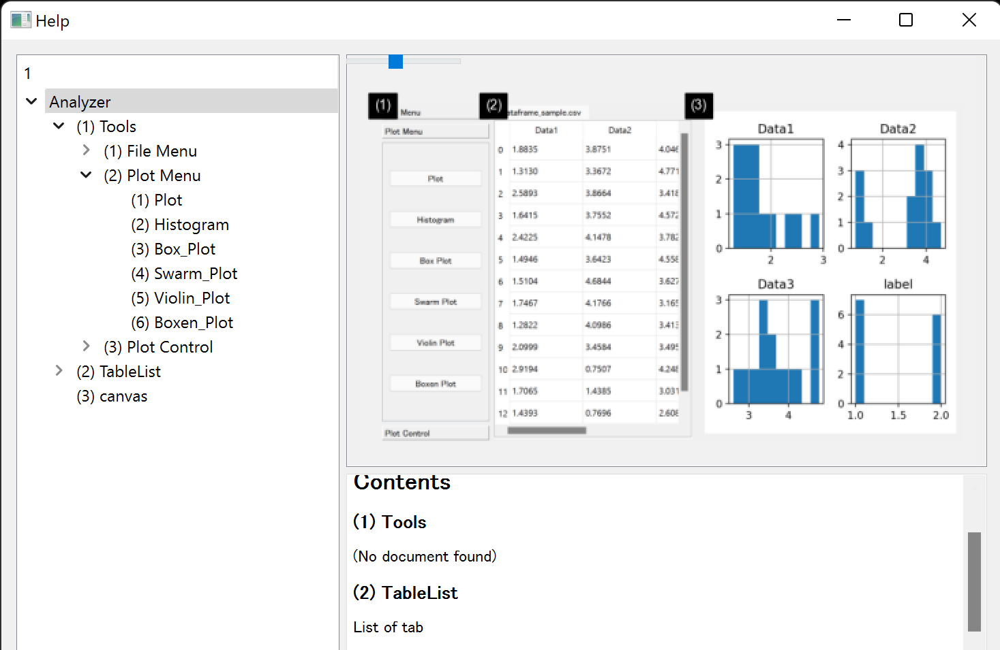

===========
Quick Start
===========

.. contents:: Contents
    :local:
    :depth: 2

Basics
------

In ``magicgui``, you can convert functions into widgets. For instance,

.. code-block:: python

    from magicgui import magicgui

    @magicgui
    def print_text(text: str):
        print(text)

    print_text.show()

will create a widget that is composed of a line edit (for the input argument ``text``) and a
call button.

Similarly, with ``magicclass`` decorator, you can convert a Python class into a ``magicgui``'s
``Container`` widget and its methods appear as push buttons. When a button is clicked, the
corresponding magicgui will be popped up.

.. code-block:: python

    from magicclass import magicclass

    @magicclass
    class MyClass:
        def set_value(self, value: str):
            self.value = value

        def print_value(self):
            print(self.value)

    ui = MyClass()
    ui.show()

.. image:: images/fig_1-1.png

.. note::

    Methods whose names start with "_" are considered as inner functions so that they
    will not be converted into widgets.

With exactly the same class design, you can also create a menu bar, a context menu or
a tool bar, using ``@magicmenu``, ``@magiccontext`` and ``@magictoolbar`` respectively.
Go to :doc:`nest` for more details.

Use Other Widgets in magic-class
--------------------------------

Magic classes can also detect other ``magicgui``'s widgets.

.. code-block:: python

    from magicgui.widgets import LineEdit, Slider
    from magicclass import magicclass

    @magicclass
    class MyClass:
        s = LineEdit(label="Name:")
        i = Slider(label="Age:", max=100)
        def print(self):
            print(f"{self.s.value} ({self.i.value})")

    ui = MyClass()
    ui.show()

.. image:: images/fig_1-2.png

.. note::

    I highly recommend using ``field`` function to create widgets in magic classes.
    See :doc:`use_field`.

If a method is decorated with ``@magicgui``, it will directly added in the container widget,
in place of a push button. This is natural because decorated methods are no longer functions,
but ``FunctionGui`` widgets.

.. code-block:: python

    from magicgui import magicgui
    from magicclass import magicclass

    @magicclass
    class MyClass:
        @magicgui
        def input_parameters(self, s: str, i: int):
            self.s = s
            self.i = i

        def print(self):
            print(f"{self.s} ({self.i})")

    ui = MyClass()
    ui.show()

Macro Recording
---------------

Another outstanding feature of magic class is its **macro recorder functionalities**.
Function calls and value changes in child widgets are all recorded and you can generate
executable Python script at any time.

Recorded macro is stored in the ``macro`` attribute. You can generate Python script as
string just by passing it to ``str``.

.. code-block:: python

    macro_string = str(ui.macro)
    print(macro_string)

A macro editor widget is always tagged at ``macro.widget``. It is a ``magicgui`` widget
so you can open it by ``show()`` method or directly append it to GUI.

.. code-block:: python

    ui.macro.widget.show() # show widget as a separate window.
    ui.append(ui.macro.widget) # append macro as a child widget.

By default, the script shown in the macro editor is synchronized, that is, automatically
updated whenever macro itself is updated.

Occasionally, you may want some functions not to record macro (such as a function that
only shows a help window). It could also be redundant to record value changes of some
widgets. You can prevent macro recording with ``do_not_record`` decorator for methods
(or ``record=False`` option for fields; see :doc:`use_field`).

.. code-block:: python

    from magicclass import magicclass, do_not_record

    @magicclass
    class Main:
        @do_not_record
        def f(self):
            """this function will never be recorded"""

    ui = Main()
    ui.show()

Make Document of Your Widgets Automatically
-------------------------------------------

It is usually time consuming to make a help menu of a widget all the way. You also have to keep
it updated whenever UI changed.

Magic class has a powerful help widget builder. You can create a help widget using ``build_help``
function. The widget has a website-like layout and many information such as tooltips of widgets
and parameter annotations of functions are summerized with rich texts.

.. code-block:: python

    from magicclass import magicclass, build_help

    @magicclass
    class Main:
        # many functions and widgets here.
        ...

    help = build_help(self) # build_help returns a Widget object
    help.show() # show widget

Add Functions after Construction
--------------------------------

Making a button or menu action dynamically is also useful, especially when you already have a
UI platform but you still want some extensions like plugin system. You don't have to worry
about that since magic class construction itself is dynamic. Just ``append`` well-typed
functions to magic class object.

.. code-block:: python

    def new_function(i: int, s: str):
        ...

    ui.append(new_function) # then a proper widget appears in the GUI

.. note::

    If you want to convert the function into a menu action, your code will look like this.

    .. code-block:: python

        @magicclass
        class A:
            @magicmenu
            class Menu:
                ...

        ui = A()
        ui.Menu.append(new_function)

    For details of menu bar, see :doc:`nest`.

Parameter Options
-----------------

In ``magicgui`` you can define parameter options with keyword arguments:

.. code-block:: python

    @magicgui(a={"widget_type": "Slider", "step": 10})
    def f(a: int): ...

However, magic classes need another way to do this because ``magicgui`` will never be called by users.
``magicclass`` uses ``set_options`` decorator instead.

.. code-block:: python

    from magicclass import magicclass, set_options

    @magicclass
    class Main:
        @set_options(a={"widget_type": "Slider", "step": 10})
        def f(self, a: int): ...

    ui = Main()
    ui.show()

.. image:: images/fig_1-4.png

Change Button Designs
---------------------

Aside from those options of ``magicgui`` popup widget to run functions, you may also want to change
the design of button itself. ``magicclass`` uses ``set_design`` decorator to do this.

.. code-block:: python

    from magicclass import magicclass, set_design

    @magicclass
    class Main:
        @set_design(text="Click (if you want)", min_height=120)
        def f(self): ...

    ui = Main()
    ui.show()

``set_design`` can take properties of ``PushButton`` as arguments.

Post Initialization
-------------------

Widgets are constructed only after ``__init__`` is called. To change widget designs or
geometries, you should not call those methods in ``__init__`` because they are not
constructed yet.

Similar to the builtin ``dataclass``, ``__post_init__`` method is used as the post
initalization procedure. It is called after widget is completely built.

.. code-block:: python

    @magicclass
    class Main:
        def __init__(self):
            # self["func"] <-- this is not correct. Button "func" is not ready!
            ...

        def __post_init__(self):
            self["func"].min_height = 100

        def func(self): ...

Code Completion
---------------

A problem of using decorators to overwrite classes is code completion. When you are
coding, the classes do not inherits magic classes yet, so IDE and console don't know
they will have attributes such as ``self.parent_viewer`` or ``self.name``.

All the magic classes inherits ``MagicTemplate`` class. This class is designed in a
way which does not interfere with magic class decorators, while provides enough
information of typings and annotations.

.. code-block:: python

    from magicclass import magicclass, MagicTemplate

    @magicclass
    class MyClass(MagicTemplate): # inherit here
        ...
