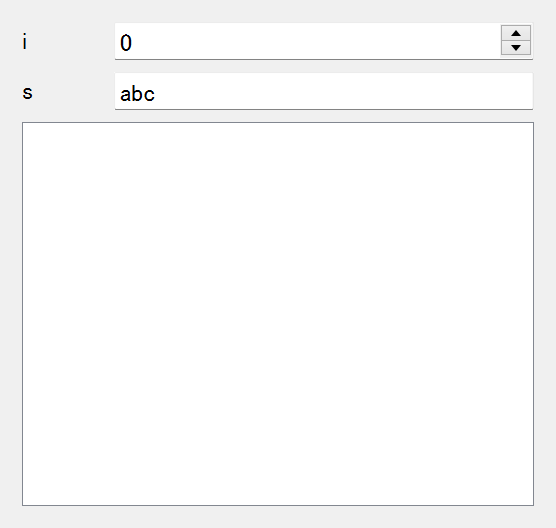

=========================
Use Fields in magic-class
=========================

MagicFields
===========

When widgets are directly provided in a magic class as class variables, they should be considered as "fields".
The concept of fields was actually introduced in Python as an standard library ``dataclasses`` as a ``Field``
object. A field is in a state of "ready to be converted into a object", i.e., a new object is created for every
instance construction.

.. code-block:: python

    from dataclasses import dataclass, field

    @dataclass
    class C:
        i: int = field(default=5)
        s: str = field(default_factory=str)

    c = C()
    c

.. code-block:: python

    C(i=5, s='')

Here, the arguments ``default`` and ``default_factory`` are reminiscent of "default value" and "type annotation"
in ``magicgui``. To apply the concept of field to widget construction, ``magic-class`` has ``MagicField``, a
subclass of ``Field``, which can store defaults as a object that is ready to be converted into a widget.

.. code-block:: python

    from magicclass import field

    fld = field(str, options={"value": "initial"})
    fld

.. code-block::

    MagicField(name='',type=None,default=<dataclasses._MISSING_TYPE object at 0x0000018E067891F0>,default_factory=<class 'str'>,init=True,repr=True,hash=False,compare=False,metadata=mappingproxy({'widget_type': None, 'options': {'value': 'initial'}}),_field_type=None)

.. code-block:: python

    fld.to_widget()

``field`` can be used very similar to the ``create_widget`` fucntion in ``magicgui``.

.. code-block:: python

    field(int, widget_type="Slider", options={"max": 10})

The first argument of ``field`` can be type, value or widget type.

.. code-block:: python

    from magicclass import magicclass, field
    from magicgui.widgets import Table

    @magicclass
    class MyClass:
        i = field(int)
        s = field("abc")
        table = field(Table)

    ui = MyClass()
    ui.show()

Define Callbacks
----------------

Another feature of widgets are their ability to emit signals upon state changes. In ``magicgui``, most of
them have the same API ``widget.changed.connect(callback)``. Owing to the simplicity, callback functions
can be safely bound to ``MagicField`` with ``connect`` method.

.. code-block:: python

    from magicclass import magicclass, field

    @magicclass
    class MyClass:
        a = field(int)

        @a.connect
        def _callback(self):
            print("value changed!")

Make Fields More Property-like
------------------------------

In many cases, you don't need all the controls of a widget. If you only need the value of a field, you
might not want to get the value via ``self.widget.value`` all the way.

Magic-class provides another field class called ``MagicValueField``, which returns the value itself when
the field get accessed. You can create ``MagicValueField`` object using ``vfield`` function. You can also
defined callbacks similar to ``MagicField``.

.. code-block:: python

    from magicclass import magicclass, vfield

    @magicclass
    class MyClass:
        a = vfield(int)

        @a.connect
        def _callback(self):
            print("value changed!")

        def print_value(self):
            print(f"a = {self.a}") # instead of "self.a.value"!

FieldGroup
==========

TODO

.. code-block:: python

    from magicclass import FieldGroup, vfield

    class Points(FieldGroup):
        x = vfield(float)
        y = vfield(float)

    class A:
        # FieldGroup is a subclass of Container
        points = Points(layout="horizontal", labels=False)

        def get_point(self):
            return (self.points.x, self.points.y)

Use Fields in Non-GUI Classes
=============================

``MagicField`` is also designed for general usage of widgets.
